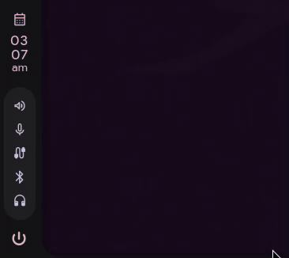

# Caelestia shell integration

Bar widget for [caelestia-dots/shell](https://github.com/caelestia-dots/shell)
(Quickshell): a headphones icon in the status column that turns orange at ≤20%
and red at ≤10%, with a Synapse-style hover popout (progress ring, percentage,
and a bolt badge while charging), plus a row of color swatches and an on/off
toggle to control the RGB lighting. Battery updates every 60 s, plus instantly
on USB plug/unplug via `udevadm monitor`.



Requires `kraken-battery` and `kraken-rgb` installed at `~/.local/bin/` (see
the main README).

## Files

- `KrakenBattery.qml` → copy to `services/` (singleton that polls
  `kraken-battery --json`)
- `KrakenRGB.qml` → copy to `services/` (singleton that fire-and-forgets
  `kraken-rgb` calls)
- `Kraken.qml` → copy to `modules/bar/popouts/` (the hover popout — battery
  ring plus RGB swatches/toggle)

## Manual edits

In `modules/bar/components/StatusIcons.qml`, add a loader after the existing
battery icon:

```qml
// Headset battery icon (Razer Kraken V4 Pro)
WrappedLoader {
    name: "krakenbattery"
    active: KrakenBattery.available

    sourceComponent: MaterialIcon {
        animate: true
        text: "headphones"
        color: {
            if (KrakenBattery.percentage <= 10)
                return "#f44336";
            if (KrakenBattery.percentage <= 20)
                return "#ff9800";
            return root.colour;
        }
        fill: 1
    }
}
```

In `modules/bar/popouts/Content.qml`, register the popout next to the existing
`battery` one:

```qml
Popout {
    name: "krakenbattery"
    sourceComponent: Kraken {}
}
```

Then restart the shell (`qs kill -c caelestia && qs -c caelestia -n -d`).
